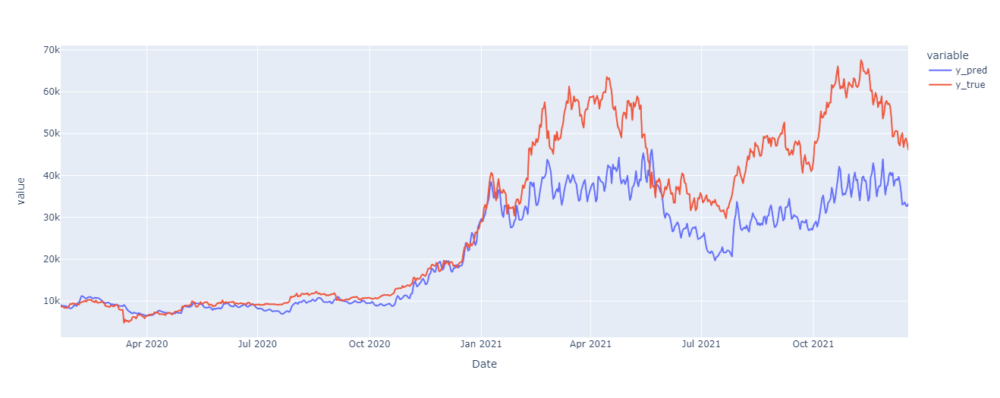

# BTC_GRU-forecast
Bitcoin price forecasting using GRU recurrent neural network. The approach followed to solve this forecasting problem consists on the design of a recurrent neural network model. Data was collected, analysed and processed, in order to ensure the quality of the training process. Features were selected based on correlation, excluding the ones with high correlation with price, since it is the parameter the model should estimate. Different model architectures with different combinations of hyperparameters were tested, in order to fine tune the model. The results were better than expected: the final model was able to forecast trends with great accuracy, accomplishing one of the main goals of this project, even tough it couldn't estimate precise values for the price.

## Problem and Methodology

### Feature Selection

In order to build the model, it is essential to have a good feature selection for training it. https://data.nasdaq.com/ has a set of features for several cryptocurrencies as well as other useful financial data from other markets. They also provide an API for data extraction that enables a simple integration to the code developed. After getting the features, they will need to be normalized, filtered and selected.

Normalization is essential in machine learning algorithms that use gradient descent, like the one that will be used. If we look at the formula for gradient descent:

$\Theta_j = \Theta_j - \alpha \frac{1}{m} \sum_{i=1}^{m}(h_\Theta(x^{(i)}) -y^{(i)} ) x_{j}^{(i)}$,

the multiplication by a factor of x (in the end) will produce different gradients steps if they are not normalized, leading to disparities. The normalization allows for a smoother rate of gradient change until they reach the equilibrium point.\newline
The other aspect, comparing the features among each other to find out their correlation, is important because even though more features could lead to better results, if they have too high of a correlation they don't bring new information to the model.

### Model Construction

Most of the papers in the area talk about RNN and LSTM when predicting cryptocurrency prices. Most recent papers also talk about GRU algorithms (Gated Recurrent Unit), as an emergent and novel algorithm for time series forecasting. Some compares LSTM with GRU, and concludes GRU is the best option overall, but there's no significant difference. It's also noted that GRU is really strong following tendencies, not so much the actual price.

Assuming those conclusions, a GRU network was implemented. As for the architecture, different amounts of GRU blocks were tested, as well as dropouts, that will help with over-fitting. The number of blocks (GRU plus dropout) will be defined after observing the results a given architecture produces. At the end of it will be a dense block, with linear activation function.

© Flávio Silva, Gonçalo Duarte Nunes

Source code will not be disclosed, but it can be shared if necessary
